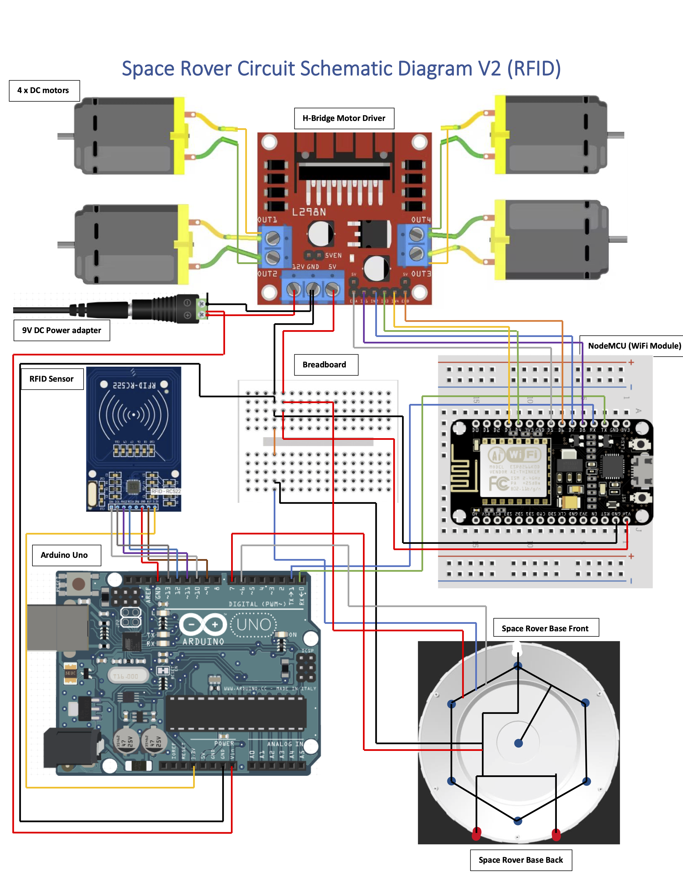

# Open Liberty Space Rover

The Space Rover has six blue LEDs underneath the spaceship model, one white head light LED, and two red tail light LEDs. The "front" of the Space Rover is designated by the white head light, and all directions for gesture control/keyboard control movement of the Rover follow that convention; for example, FORWARD will drive in the direction the white head light LED is facing.

The Space Rover contains two microcontrollers: Arduino UNO and NodeMCU.

The NodeMCU handles the WiFi connection to the services and controls the 4 DC motors for the Rover's movement.

The Arduino controls the color sensor for color detection, along with the LEDs that are connected to the Rover, including the head and tail lights.

Both the Arduino and NodeMCU are serially connected, via the software TX and RX pins on both microcontrollers.

The NodeMCU will receive Game Start, Game End, and Directional (Forward - F, Backward - B, Left - L, Right - R, Stop - S) messages from the game service via a web socket connection. The Game Start and Game End messages will be forwarded serially to Arduino, to notify the LEDs to react accordingly. Once the game play is in session, the color sensor will send the detected colors (Blue - "BLU", Green - "GRN", Yellow - "YW", Purple - "PUR", Red - "RED") to the NodeMCU, which will then be forwarded to the game service.

## Circuit Schematic Diagram

In the circuit diagram below, you can find the wire connections between the Arduino, NodeMCU, H-Bridge Motor Driver, 4 x DC motors, Color sensor, and the Rover LEDs.

### L298N H-Bridge Motor Driver Pin Mapping to NodeMCU:
- ENA -> D5
- IN1 -> D8
- IN2 -> D7
- IN3 -> D4
- IN4 -> D3
- ENB -> D6

### Color Sensor Pin Mapping to Arduino UNO:
- s0 -> 13
- s1 -> 9
- s2 -> 10
- s3 -> 11
- e0 -> GND
- out -> 12

### LED Pin Mapping to Arduino UNO:
- Blue LEDs -> 8, 7, 6, A0, 5, 4
- Headlight/Tailights -> A1
- Damage LED -> A2

