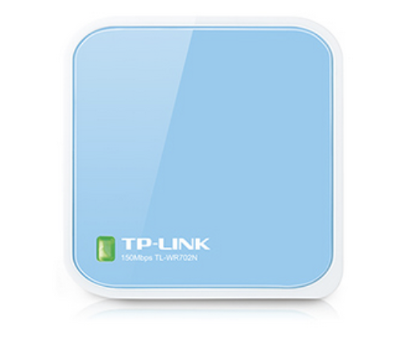
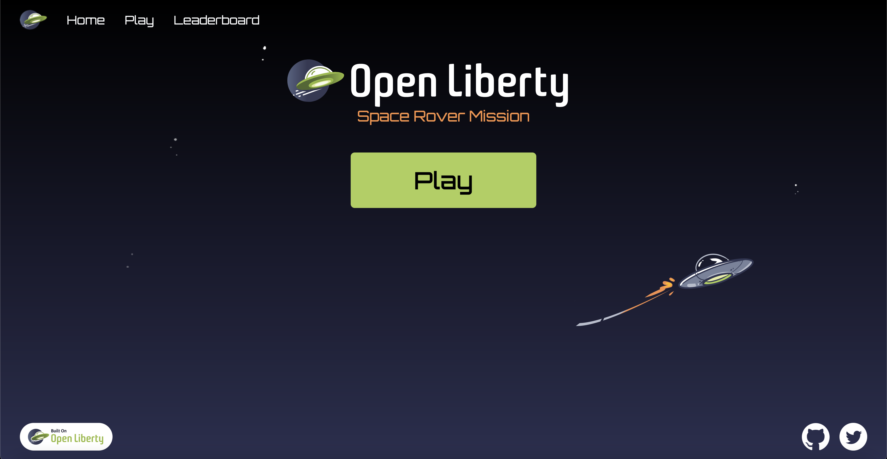
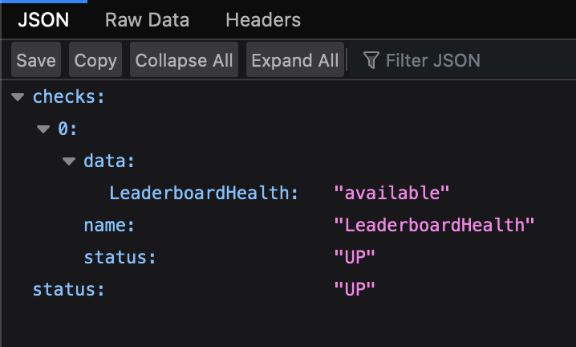
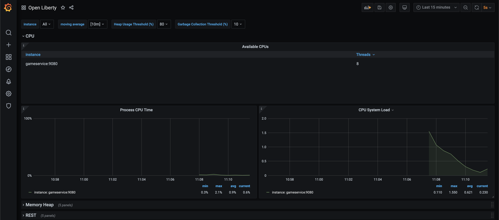

# Setup

## Local Network

Connect the WiFi Router into a nearby power supply, wait till the green light starts blinking, which indicates it has successfully created a local WiFi network.

  

#

## Devices

The space rover mission has two physical devices to set up: the space rover and the game board. Both devices have LEDs that display light patterns for the following setup, standby, and gameplay states:
* Connecting to WiFi
* Waiting for a websocket connection
* Websocket connected, waiting for game start
* Game Started

When powered on, both devices will automatically attempt to connect to WiFi, and after connecting successfully, will wait for a websocket connection until the game service connects. **_The game will not start until both devices are connected to a websocket._**

See the light patterns representing the setup, standby, and gameplay states for the space rover [here](./setup.md#states) and for the game board [here](./setup.md#states).

## Space Rover

1. Plug the space rover into a power outlet.
 &nbsp; 

2. Flip the switch on the power cord to turn the space rover on. **Note:** When the rover is initially powered on, it will "jolt".
 &nbsp; 

### States

The space rover displays the following light patterns to represent different setup, standby, and gameplay states.

* **Blinking Blue Lights + Head/Tail Lights OFF --> Connecting to WiFi**
 &nbsp; 
* **Cycling Blue Lights + Head/Tail Lights Blinking --> Waiting for a websocket connection**
 &nbsp; 
* **Solid Blue Lights + Blinking Head/Tail Lights -->  Websocket connected, waiting for game start**
 &nbsp; 
* **Solid Blue Lights + Solid Head/Tail Lights --> Game Started**
 &nbsp; 

## Game Board

1. Set out the four separate boards in the following layout:
##

2. Connect the four boards together using the three-pin connectors between the boards. There are eight one-sided connectors in total - two for each board - that will create four connections between the boards. ****IMPORTANT: _Ensure that the wire colours coordinate when the connectors are linked -- the red wires (power), green wires (data line), and black wires (ground) should all line up when connected._**
## 

3. After the connectors are linked, push the connected section into either of the board holes that the connectors come out of.
##

4. Push the four boards together and ensure the four center corners (the sun) are aligned.
##
5. Using the metal clamps, fasten the board together at the ends of each of the board's perpendicular intersections.
##
6. Unfold the metal barrier into a rectangle (black side in, silver side out).

### States

In the following section, the game board LEDs are split into different naming categories.

* **SUN** = the LEDs encircling the sun in the center of the board
* **PLANETS** = all planet LEDs, the four 5x5 LED grids inside each planet
    * **EARTH** = blue planet on the board, configured to have **blue** LEDs
    * **JUPITER** = white planet on the board, configured to have **green** LEDs
    * **VENUS** = yellow planet on the board, configured to have **yellow** LEDs
    * **OPENLIBERTY** =  on the board, configured to have **purple** LEDs
* **OBSTACLES** = the LEDs inside the asteroids and black hole

The game board displays the following light patterns to represent different game states.

* **Blinking Red SUN--> Connecting to WiFi**
* **One Green Flash of All LEDs--> CONNECTED to WiFi**
* **Bursting SUN + PLANETS --> Waiting for a websocket connection**
* **Solid Blue SUN -->  Websocket connected, waiting for game start**
* **Red SUN + EARTH ON + Red OBSTACLES --> Game Started**

#

## Mini PC

1. Plug in the Mini PC and press the red button to turn it on.
##
2. Once the Mini PC is on and the login page is up, log in using the following credentials:

    * username: spacerover 
    * password:  was4ever
##
3. The containers running the game will automatically start up in the background.
##
4. Ensure that the Mini PC is connected to the **OL_DEMO** internet.
##
5. Open Firefox and verify that four tabs are automatically generated with the following endpoints:

    * **Webapp** => localhost:3000/
         &nbsp; 
    * **Game Service Health** => localhost:9070/health
         &nbsp; 
    * **Leaderboard Health** => localhost:9080/health
         &nbsp; 
    * **Grafana** => localhost:3010/
         &nbsp; 
        
        If needed, login into Grafana with:
        * username: admin
        * password: admin
##
6. Return to the webapp tab's game page and leave it in the home page with the play button.

#

## Gesture Controls

_TODO: MALHAR
