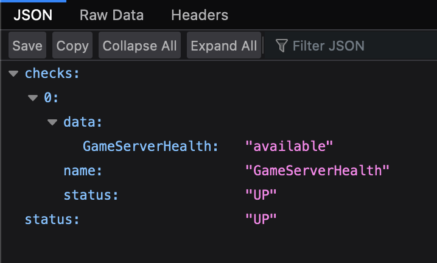

# Setup

The following guide goes through how to set up the different components for the OpenLiberty Space Rover mission demo.

## Local Network

Connect the WiFi Router into a nearby power supply and wait until the green light starts blinking, which indicates a local WiFi network has been successfully created.

  

## Devices

The Space Rover mission has two physical devices to set up: the Space Rover and the Game Board. Both devices have LEDs that display light patterns for the following setup, standby, and gameplay states:
* Connecting to WiFi
* Waiting for a websocket connection
* Websocket connected, waiting for game start
* Game Started

When powered on, both devices will automatically attempt to connect to WiFi, and after connecting successfully, will wait for a websocket connection until the game service connects. **_The game will not start until both devices are connected to a websocket._**

See the light patterns representing the setup, standby, and gameplay states for the Space Rover [here](./setup.md#space-rover-state-light-patterns) and for the Game Board [here](./setup.md#game-board-state-light-patterns).

## Space Rover

The following instructions detail how to set up the Space Rover.

1. Plug the Space Rover into a power outlet.
 &nbsp; 

2. Flip the switch on the power cord to turn the Space Rover on. **Note:** When the rover is initially powered on, it will "jolt".

[https://user-images.githubusercontent.com/31871360/162487597-b3590a36-6800-41ad-a065-5a428be69f76.mov](https://user-images.githubusercontent.com/31871360/171911083-6930cd98-a069-4f21-96fb-1fd3dea7fddf.MOV)

### Space Rover State Light Patterns

The Space Rover has six addressable LEDs underneath the spaceship model, one white head light LED, and two red tail light LEDs. The "front" of the Space Rover is designated by the white head light, and all directions for gesture control/keyboard control movement of the Rover follow that convention; for example, FORWARD will drive in the direction the white head light LED is facing.

The Space Rover displays the following light patterns to represent different setup, standby, and gameplay states.

**Solid Red Lights + Head/Tail Lights OFF + Canopy Red Light**: Error state, recommend to switch OFF/ON the Space Rover.

**Blinking Red Lights + Head/Tail Lights OFF**: Connecting to WiFi

https://user-images.githubusercontent.com/31871360/171911033-e5e5cfcb-ab37-4efc-84e7-eab11ec93cd6.MOV

**Breathing Rainbow Lights + Head/Tail Lights OFF**: Waiting for a websocket connection

https://user-images.githubusercontent.com/31871360/171911083-6930cd98-a069-4f21-96fb-1fd3dea7fddf.MOV

**Solid Turquoise Lights + Blinking Head/Tail Lights**: Websocket connected, waiting for game start

https://user-images.githubusercontent.com/31871360/171911111-c6d07857-3885-4ef6-a0b9-b0890a70592b.MOV

**Solid Turquoise Lights + Solid Head/Tail Lights**: Game Started

## Game Board

The following instructions detail how to set up the Game Board.

1. Set out the four separate boards in the following layout:

2. Connect the four boards together using the three-pin connectors between the boards. There are eight one-sided connectors in total - two for each board - that will create four connections between the boards. **_Ensure that the wire colours coordinate when the connectors are connected -- the red wires (power), green wires (data line), and black wires (ground) should all line up when connected._**

3. After the connectors are connected, push the connected section into either of the board holes that the connectors come out of (refer to video below).

https://user-images.githubusercontent.com/31871360/162499249-462154af-2683-4a08-87a7-d8d280783a10.MOV

4. Using the metal clamps, fasten the board together at the ends of each of the board's perpendicular intersections (refer to video below).

https://user-images.githubusercontent.com/31871360/162499288-a1d28717-2cb4-4a22-a028-11e9f76ccde3.MOV

5. Push the four boards together and ensure the four center corners (the sun) are aligned.

6. Unfold the metal barrier into a rectangle (black side in, silver side out). The barrier has eight "connections": seven are taped connections, and one is tied (circled red in the image below). Unfold the barrier into a big rectangle according to the image below, where each "side" of the big rectangle is made of either two short sides or two long sides of the individual four boards (in the image: S - short, L - long).

7. When looking at the board in the orientation from step 1 of this section, the tied corner of the rectangular barrier should fit over the bottom-left corner of the fully connected board. Fit the three taped corners of the rectangular barrier over the top-left, top-right, and bottom-right corners of the board. Then, fit the last tied corner over the bottom-left corner of the board.

8. Fasten the bottom of the tied corner with a twist-tie.

9. Place the four plexiglass sheets onto the board; one sheet over each of the four smaller boards. The plexiglass sheet with the red arrow should be placed over the board with planet Earth, and the red arrow should be positioned in the bottom left corner. Place the Space Rover over the red arrow, with the Rover's head light facing the direction of the arrow -- this is the Rover's starting position at the beginning of each game.

10. Plug the power source into the board.

11. Flip the switch on the power cord to turn the Game Board on.

### Game Board State Light Patterns

In the following section, the Game Board LEDs are split into different naming categories.

* **SUN**: the LEDs encircling the sun in the center of the board
* **PLANETS**: all planet LEDs, the LED rings on each planet
    * **EARTH**: blue planet on the board, configured to have **blue** LEDs
    * **JUPITER**: white planet on the board, configured to have **green** LEDs
    * **VENUS**: yellow planet on the board, configured to have **yellow** LEDs
    * **OPENLIBERTY**:  on the board, configured to have **purple** LEDs
* **OBSTACLES**: the LEDs inside the asteroids and black hole

The Game Board displays the following light patterns to represent different game states.

**Blinking Red SUN:** Connecting to WiFi, **One Green Flash of All LEDs:** CONNECTED to WiFi

https://user-images.githubusercontent.com/31871360/171955438-03cb8857-6049-40e6-b550-b4303c9adf22.MOV

**Bursting SUN + PLANETS:** Waiting for a websocket connection

https://user-images.githubusercontent.com/31871360/171955445-425cdc56-146a-4461-9e1c-a623965a2abe.MOV

**Solid Blue SUN:**  Websocket connected, waiting for game start

## Mini PC

The following instructions detail how to setup the Mini PC used to run the game service, leaderboard service, and game UI.

1. Plug in the Mini PC and press the red button to turn it on.

2. Once the Mini PC is on and the login page is up, log in using the following credentials:
    * username: spacerover 
    * password:  was4ever

3. The containers running the game will automatically start up in the background.

4. Ensure that the Mini PC is connected to the **OL_DEMO** internet.

5. Firefox will automatically open; verify that four tabs are generated with the following endpoints:

    * **Webapp** => localhost:3000/
         &nbsp; 
    * **Game Service Health** => localhost:9070/health
          &nbsp; 
    * **Leaderboard Health** => localhost:9080/health
          &nbsp; 
    * **Grafana** => localhost:3010/
    * There are two dashboards: Liberty Metrics Dashboard and Space Rover Mission statistics Dashboard
        
        Liberty Metrics Dashboard:
         &nbsp; 
        
        Space Rover Mission statistics Dashboard:
        
        
        If needed, login into Grafana with:
        * username: admin
        * password: admin

6. Return to the webapp tab's game page and leave it in the home page with the play button.

## Laptop with a Camera

The following instructions detail how to setup the Laptop used to run the Gesture Recognition GUI for the player.

1. Power on the Laptop by pressing the power button.

2. Once the Laptop is on and the login page is up, log in using valid credentials.

3. Ensure that the Laptop is connected to the **OL_DEMO** internet.
 
4. Open VSCode application on the Laptop.

5. Run the file labelled Version2.py by running in the console `/usr/local/bin/python3 "/Users/spacerover/Desktop/Space Rover/Version2.py"`.

6. Check the console output, and wait for a Connected console output. This indicates a successful connection to the backend service.

7. A GUI application pictured as a Rocket will startup, put this application in full screen.

8. User can now test hand gestures prior to starting the game on the Front End GUI. After the game starts on the Front End GUI, you will be able to control and move the car with the hand gestures.

