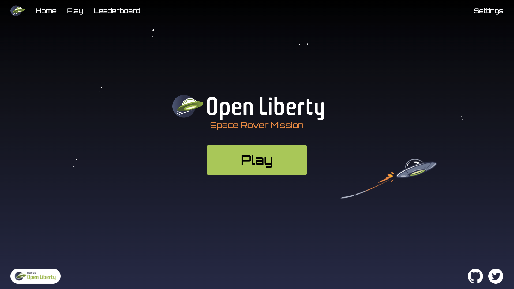
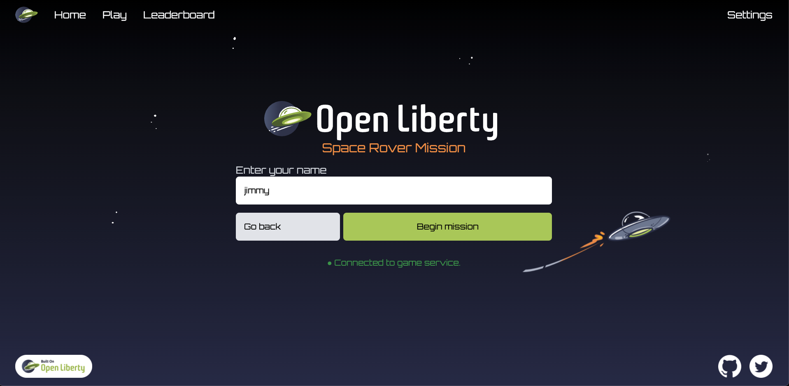
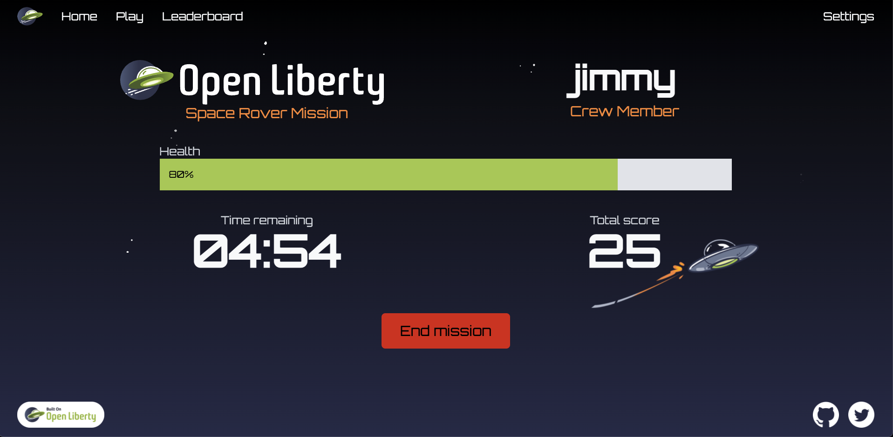
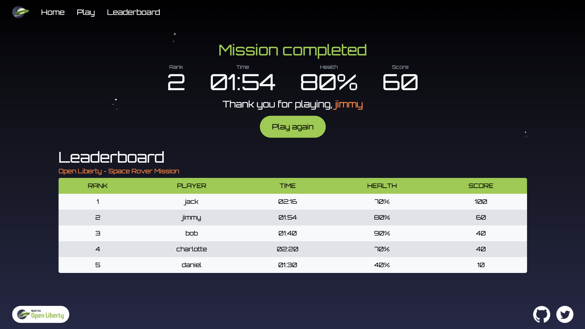
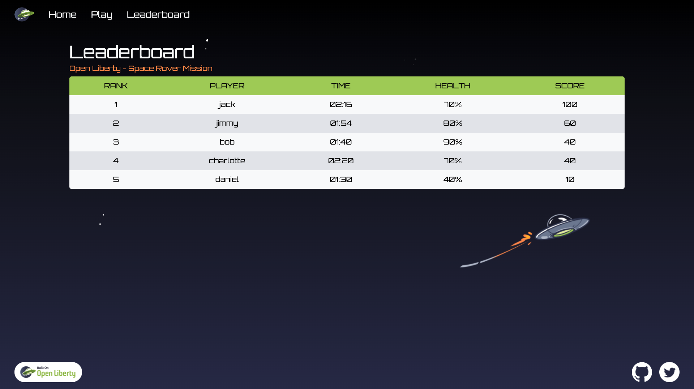

# Client

This folder contains the code for the UI used to play the game and view the leaderboard. The UI interacts with the game service via websockets and the leaderboard service via http.

## How to run

This project is built using Docker by the main docker-compose file which creates a production build and serves the build artifacts using Nginx at http://localhost:3000.

This project can also be started on its own in development mode by running `npm start`.

## Main technologies
- React
- TypeScript
- Tailwind CSS
- WebSockets

## Views

### Home: `/`

### Signup: `/play`

### InGame: `/play`

### GameEnd: `/leaderboard?player={name}&gameMode={gameMode}`

### Leaderboard: `/leaderboard?gameMode={gameMode}`

